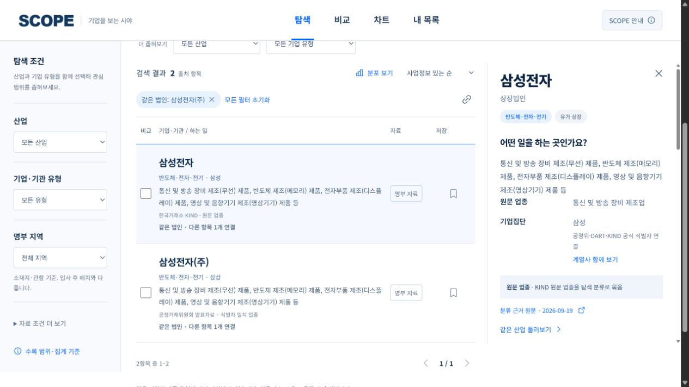

# SCOPE · 스코프

### 기업을 보는 시야

**산업과 기업집단에서 기업을 발견하고, 출처가 있는 정보를 비교해 관심 후보를 정리합니다.** 회사 이름을 이미 알고 있어야 시작할 수 있는 검색의 한계를 줄이는 기업 탐색 도구입니다.

[서비스 바로가기](https://scope-atlas.pages.dev/) · [데이터 출처와 기준](docs/DATA.md) · [검증·운영 안내](docs/OPERATIONS.md)




## 주요 기능

| 흐름 | 기능 |
|---|---|
| 발견 | 산업별 20개 진입점, 기업 유형별 6개 경로, 기업집단 102개에서 탐색 시작 |
| 검색 | 기업명·공시 법인명·그룹·제품·업종 검색, 지역·유형·출처 필터, 정렬·페이지 이동 |
| 이해 | 사업·등록 업종, 주요제품, 홈페이지, 명부 기준일과 분류 근거 확인 |
| 연결 | 공식 식별자로 확인한 동일 법인의 다른 명부 모아보기, 이름만 같은 후보 구분 |
| 비교 | 최대 3개 항목 비교, 확인된 차이만 보기, 미확인 구분, 표시 항목 CSV |
| 차트 | 산업·유형·지역·법인 확인 상태 분포, 표·CSV·PNG, 구성 기업으로 이동 |
| 정리 | 브라우저에 관심 목록·메모·다음 확인 항목 저장, 검색, JSON 백업·복원 |

모바일에서는 필터를 접이식 패널로, 상세정보를 전체 폭 패널로 엽니다. 검색·필터·비교·차트 조건을 URL로 공유할 수 있으며 개인 메모는 공유 URL에 포함하지 않습니다.

## 데이터 수록 범위

**2026-09-20 빌드 기준 17,321개 출처 항목**입니다. 같은 기업이 여러 명부에 나타나므로 고유 기업 수나 국내 전체 기업 수가 아닙니다. 각 명부의 기준일은 서로 다릅니다.

| 명부 | 출처 항목 수 |
|---|---:|
| 중앙 공공기관 | 342 |
| 지방공기업 | 423 |
| 지방 출자·출연기관 | 892 |
| 금융회사 등록자료 | 5,516 |
| 공시대상기업집단 계열사 | 3,538 |
| 중견기업 확인서 명부 | 3,855 |
| KIND 상장법인 | 2,755 |
| **합계** | **17,321** |

DART 기업개황 119,391행을 **보강용 참조자료**로 사용했습니다. 참조자료 전체를 탐색 목록에 추가하지 않았습니다.

- 공식 식별자를 대조한 항목: **9,784행**. 여러 명부 사이에서 연결한 법인: **1,484개 / 3,064행**.
- 산업 근거 미확보: **802행**. 업종 근거는 있지만 기타·복합사업으로 남는 **731행**과 구분합니다.
- 사업·등록 업종 미기재: **1,646행**, 홈페이지 미기재: **6,476행**.
- 152개 중앙 기관에 과거 공식 채용공고 153건을 연결했습니다. 현재 모집 중이라는 뜻은 아닙니다.

### 해석 기준

1. 수록 수를 산업 규모나 채용 기회로 해석하지 않습니다. 금융 등록자료에는 지역 조합·금고 3,625개가 포함됩니다.
2. 공식 업종, 식별자 일치 연결, 이름 일치 연결, 기관명 기반 추정을 구분합니다. 탐색 산업은 원문 업종을 재분류한 결과입니다.
3. 이름만으로 법인을 병합하지 않으며, 식별자가 충돌하면 연결을 보류합니다. 기존 출처 ID와 기준일을 보존합니다.
4. 일부 사업정보는 제품 설명 대신 ‘공시 업종’입니다. 연봉·지원 적격·합격 가능성·현재 영업 여부는 산정하지 않습니다.
5. 홈페이지는 명부 기재값입니다. 모든 링크의 현재 유효성을 확인한 것은 아닙니다.

세부 출처·단위·연결 규칙·재현 범위는 [데이터 문서](docs/DATA.md)에 있습니다.

## 빠르게 실행하기

**Node.js 22 이상과 npm**이 필요합니다. Python은 데이터 처리와 연결 로직 검증에 사용하며 웹앱 실행에는 필요하지 않습니다.

```bash
git clone https://github.com/pollmap/scope-atlas.git
cd scope-atlas
npm ci
npm run dev
```

터미널에 표시되는 로컬 주소를 엽니다. 비공개 저장소는 접근 권한이 있는 GitHub 계정으로 먼저 인증해야 합니다. 웹앱 실행에는 API 키나 환경변수가 필요하지 않습니다.

```bash
npm run build
npm run preview
```

빌드 결과는 `dist/client`에 생성됩니다. 저장소에 포함된 공개 데이터 스냅샷을 사용하므로 내부 조사 원본 없이도 실행·빌드할 수 있습니다.

## 검증

```bash
npm run build
npm test
python -m unittest discover -s tests -p "test_*.py"
npm run audit:release
```

- JavaScript/Sites 검사 **26개**: 데이터 합계, 공개 필드, 검색, URL, 차트, 비교, 저장·복원, 정적 호스팅.
- Python 검사 **4개**: 식별자 충돌, 동일 이름의 다른 법인, URL 정제, 산업 분류 순서.
- 릴리스 감사: 공개 파일 허용 목록, 알려진 인증정보 패턴, 검수 데이터와 빌드 데이터의 SHA-256 일치.
- GitHub Actions는 PR과 `main` 변경에 위 검사를 실행합니다. 자동 배포는 하지 않습니다.

검수 결과는 로컬 `qa/`에 생성되며 저장소에 포함하지 않습니다. 알려진 패턴 검사가 모든 개인정보를 탐지한다는 보장은 없습니다.

## 배포

현재 서비스는 **Cloudflare Pages**의 `scope-atlas` 프로젝트에서 제공합니다.

```bash
npx wrangler login
npm run build
npm run audit:release
npm run deploy
```

Cloudflare 계정의 Pages 배포 권한이 필요합니다. 다른 계정에서 운영하려면 자신의 프로젝트를 만들고 `wrangler.jsonc`와 `package.json`의 배포 프로젝트 이름을 함께 바꾸세요. 인증정보를 저장소에 넣지 마세요.

공개 주소의 HTML·SPA 경로·데이터·JS·CSS를 로컬 빌드와 대조하려면:

```bash
python -m pip install -r requirements-dev.txt
python scripts/verify-live.py
```

검증 대상은 `https://scope-atlas.pages.dev`입니다. 포크에서 별도 서비스로 배포하면 `scripts/verify-live.py`의 대상 주소도 변경하세요.

## 구조와 기술

```text
src/                 React 화면, 검색·집계·비교·저장 로직
public/data/         공개 스냅샷 catalog / evidence / manifest
scripts/             데이터 변환, 빌드·릴리스·공개 주소 검증
tests/               실제 스냅샷과 식별자 연결 회귀 검사
docs/                데이터 정의와 운영 절차
.github/workflows/   PR/main 자동검사
worker/ + .openai/   선택적 Sites 호스팅 호환 구성
wrangler.jsonc       현재 Cloudflare Pages 설정
```

React 19 · Vite 6 · ECharts 6 · Python · Cloudflare Pages. 차트·비교·내 목록 화면은 필요할 때 불러옵니다. 서버 API, 사용자 DB, 회원가입, 분석 추적 SDK는 없습니다. Sites 호환 파일은 기존 빌드 검증을 위해 유지하며 현재 운영 호스팅과 구분합니다.

## 개인정보와 저장 방식

- 관심 목록·메모는 브라우저 `localStorage`에만 저장하며 앱이 서버로 전송하지 않습니다.
- 저장 키 `career-atlas.collections.v1`은 기존 저장자료 호환성을 위해 유지합니다.
- 백업 JSON에는 사용자가 적은 메모가 들어갑니다. 공유 전에 확인하세요.
- 다른 브라우저·기기·주소에서는 자동 동기화되지 않습니다. 이전 주소에서 백업한 뒤 새 주소에서 복원하세요.
- 원본 조사 파일, 학교 제휴 본문, 개인 사례, 인증정보, 사용자 프로필은 저장소와 공개 번들에서 제외합니다.
- 호스팅 사업자의 기본 접속 처리는 앱의 별도 분석 추적 여부와 다릅니다.

## 현재 한계

자동 수집·실시간 갱신, 전체 고용주 중복제거, 실제 근무지 지도, 연봉 예측, 채용 적격 판정은 포함하지 않습니다. 데이터 변환 코드는 제공하지만 **내부 원자료는 포함하지 않으므로 원본부터의 전체 재생성에는 별도 자료 확보가 필요**합니다.

기여 시 변경 브랜치에서 작업하고 검증 결과와 데이터 근거를 PR에 남겨 주세요. 원문 자료의 이용조건은 각각의 제공처에 따르며, 이 저장소는 외부 원문에 대한 재배포 권리를 부여하지 않습니다.
